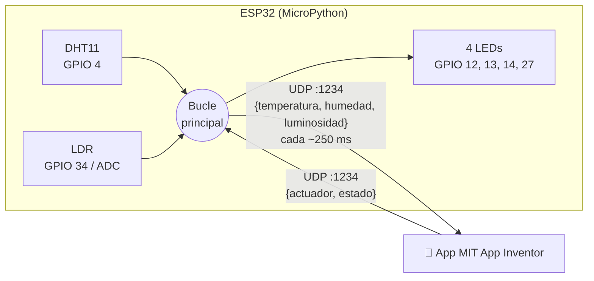
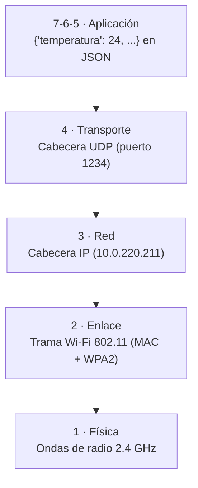
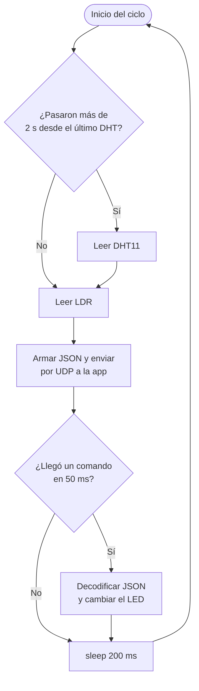

# 📡 ESP32 + MicroPython + UDP: Monitoreo y control IoT con MIT App Inventor

Sistema IoT que lee **temperatura, humedad (DHT11) y luminosidad (LDR)** con un ESP32, envía los datos a una app móvil hecha en **MIT App Inventor** usando **UDP sobre Wi-Fi**, y recibe desde la app comandos para encender/apagar **4 LEDs (actuadores)**.

## 🎥 Demostración

[](https://youtube.com/shorts/pYm8S6QhzJE)

👉 **[Ver el video en YouTube](https://youtube.com/shorts/pYm8S6QhzJE)**

---

## 📑 Contenido

1. [Arquitectura del sistema](#-arquitectura-del-sistema)
2. [Hardware y conexiones](#-hardware-y-conexiones)
3. [Modelo OSI aplicado al proyecto](#-modelo-osi-aplicado-al-proyecto)
4. [UDP vs TCP: ¿por qué UDP?](#-udp-vs-tcp-por-qué-udp)
5. [Protocolo de mensajes (JSON)](#-protocolo-de-mensajes-json)
6. [Explicación del código](#-explicación-del-código)
7. [Cifrado: estado actual y cómo agregarlo](#-cifrado-estado-actual-y-cómo-agregarlo)
8. [Instalación y uso](#-instalación-y-uso)
9. [Configuración de la app en MIT App Inventor](#-configuración-de-la-app-en-mit-app-inventor)
10. [Limitaciones y mejoras propuestas](#-limitaciones-y-mejoras-propuestas)

---

## 🏗 Arquitectura del sistema



Ambos dispositivos deben estar conectados a la **misma red Wi-Fi** (misma subred). El ESP32 actúa a la vez como:

- **Cliente:** envía periódicamente las lecturas de los sensores a la IP del celular.
- **Servidor:** escucha en el puerto `1234` los comandos que llegan desde la app.

---

## 🔌 Hardware y conexiones

| Componente | Pin ESP32 | Función |
|---|---|---|
| DHT11 (DATA) | GPIO 4 | Temperatura (°C) y humedad relativa (%) |
| LDR (divisor de voltaje) | GPIO 34 (ADC1) | Nivel de luz (0 – 4095) |
| LED amarillo | GPIO 12 | Actuador 0 |
| LED rojo | GPIO 13 | Actuador 1 |
| LED blanco | GPIO 14 | Actuador 2 |
| LED azul | GPIO 27 | Actuador 3 |

**Notas de montaje:**

- Cada LED lleva una **resistencia en serie de 220 Ω – 330 Ω** a GND.
- La LDR se conecta como **divisor de voltaje** con una resistencia fija (≈10 kΩ) entre 3.3 V y GND; el punto medio va a GPIO 34.
- GPIO 34 es **solo entrada** y pertenece al **ADC1**, que sí funciona mientras el Wi-Fi está activo (el ADC2 no se puede usar con Wi-Fi encendido).
- GPIO 12 es un *strapping pin*: si el LED tira el pin a nivel alto durante el arranque, el ESP32 podría no iniciar. Si ocurre, mueve ese LED a otro pin (p. ej. GPIO 26).

---

## 🧱 Modelo OSI aplicado al proyecto

El modelo OSI divide la comunicación en 7 capas. Así se ubica cada parte de este proyecto:

| Capa | Nombre | ¿Qué hay en este proyecto? |
|---|---|---|
| 7 | **Aplicación** | La lógica del programa: leer sensores, armar el mensaje, encender LEDs. La app de MIT App Inventor. |
| 6 | **Presentación** | Formato de los datos: **JSON** (`json.dumps` / `json.loads`) y codificación **UTF-8** (`.encode()` / `.decode()`). Aquí iría el **cifrado** de los datos. |
| 5 | **Sesión** | UDP no crea sesiones; cada mensaje es independiente. El socket abierto con `bind()` mantiene el canal disponible. |
| 4 | **Transporte** | **UDP**, puerto `1234` (`socket.SOCK_DGRAM`). |
| 3 | **Red** | **IPv4**: IP del celular (`APP_IP`) e IP del ESP32 asignada por DHCP (`wlan.ifconfig()`). |
| 2 | **Enlace de datos** | **Wi-Fi IEEE 802.11** con direcciones MAC y cifrado **WPA2** de la red. |
| 1 | **Física** | Señal de radio a **2.4 GHz** entre el ESP32, el router y el celular. |

> En la práctica, la pila TCP/IP agrupa las capas 5, 6 y 7 en una sola capa de *Aplicación*. El código solo programa las capas 5–7; las capas 1–4 las resuelve el firmware de MicroPython (lwIP) y el hardware Wi-Fi del ESP32.



Cada capa **encapsula** el mensaje de la capa superior agregando su propia cabecera; en el celular ocurre el proceso inverso (**desencapsulación**).

---

## ⚖ UDP vs TCP: ¿por qué UDP?

| Característica | **UDP** (usado aquí) | **TCP** |
|---|---|---|
| Conexión | Sin conexión: se envía y listo | Orientado a conexión (*handshake* de 3 vías) |
| Fiabilidad | No garantiza entrega ni orden | Garantiza entrega, orden y sin duplicados |
| Retransmisión | No | Sí, automática |
| Cabecera | 8 bytes | 20 bytes mínimo |
| Latencia | Muy baja | Mayor (confirmaciones ACK) |
| Socket en Python | `SOCK_DGRAM` | `SOCK_STREAM` |
| Uso típico | Telemetría, streaming, juegos, VoIP | Web (HTTP), correo, transferencia de archivos |

**¿Por qué UDP es adecuado para este proyecto?**

- Los datos de los sensores se envían **4 veces por segundo**: si se pierde un paquete, el siguiente llega 250 ms después, así que retransmitirlo no tiene sentido.
- Es **más ligero** para el ESP32 y más simple de programar (no hay que aceptar conexiones ni detectar desconexiones).
- Menor latencia: la app refleja los cambios casi en tiempo real.

**Desventaja:** un comando de la app (encender un LED) **puede perderse** sin que nadie lo note. Para comandos críticos convendría TCP o agregar una confirmación (ACK) propia — ver [mejoras](#-limitaciones-y-mejoras-propuestas).

---

## 📨 Protocolo de mensajes (JSON)

**ESP32 → App** (cada ~250 ms):

```json
{"temperatura": 24, "humedad": 61, "luminosidad": 2310}
```

| Llave | Tipo | Rango | Unidad |
|---|---|---|---|
| `temperatura` | entero | 0 – 50 | °C (DHT11) |
| `humedad` | entero | 20 – 90 | % HR (DHT11) |
| `luminosidad` | entero | 0 – 4095 | cuentas ADC de 12 bits |

**App → ESP32** (al mover un interruptor):

```json
{"actuador": 2, "estado": 1}
```

| Llave | Valores | Significado |
|---|---|---|
| `actuador` | 0, 1, 2, 3 | LED amarillo, rojo, blanco, azul |
| `estado` | 0 / 1 | Apagar / encender |

> Las llaves van en **minúsculas** y deben coincidir exactamente en el ESP32 y en la app.

---

## 🧠 Explicación del código

El programa está en [`main.py`](main.py) y se divide en 6 bloques.

### 1. Librerías

```python
import network, socket, time, dht, json
from machine import Pin, ADC
```

| Módulo | Para qué sirve |
|---|---|
| `network` | Controlar la interfaz Wi-Fi del ESP32 |
| `socket` | Crear el socket UDP (capa de transporte) |
| `time` | Medir tiempos sin bloquear (`ticks_ms`) y pausar (`sleep`) |
| `machine` | Acceso a los pines GPIO y al ADC |
| `dht` | Driver del sensor DHT11 |
| `json` | Convertir diccionarios ↔ texto JSON |

### 2. Configuración

```python
WIFI_SSID = "TU_RED_WIFI"
WIFI_PASS = "TU_CONTRASEÑA"
APP_IP = "10.0.220.211"
UDP_PORT = 1234
```

Parámetros que **debes cambiar** para tu red. `APP_IP` es la IP del celular (se ve en la configuración Wi-Fi del teléfono o en la propia app).

### 3. Pines

```python
dht_sensor = dht.DHT11(Pin(4))
ldr = ADC(Pin(34))
ldr.atten(ADC.ATTN_11DB)
```

- La atenuación de **11 dB** amplía el rango de entrada del ADC hasta ≈3.3 V; sin ella el ADC se satura a ≈1.1 V.
- `ldr.read()` devuelve un valor de **12 bits (0 – 4095)**.
- Los LEDs se guardan en una **lista** `actuadores`, de modo que el número que llega en el JSON (`actuador: 2`) se usa directamente como índice: `actuadores[2]`.

### 4. Conexión Wi-Fi

```python
def conectar_wifi():
    wlan = network.WLAN(network.STA_IF)   # Modo estación (cliente de un router)
    wlan.active(True)
    wlan.connect(WIFI_SSID, WIFI_PASS)
    while not wlan.isconnected():          # Espera hasta obtener IP
        pass
    print("Conectado! IP del ESP32:", wlan.ifconfig()[0])
```

La IP que se imprime es la que hay que poner en la app para enviar los comandos.

### 5. Socket UDP

```python
sock = socket.socket(socket.AF_INET, socket.SOCK_DGRAM)  # IPv4 + UDP
sock.bind(('0.0.0.0', UDP_PORT))  # Escucha en todas las interfaces, puerto 1234
sock.settimeout(0.05)             # recvfrom espera máximo 50 ms
```

- `AF_INET` = IPv4 (capa 3), `SOCK_DGRAM` = datagramas UDP (capa 4).
- `bind` convierte al ESP32 en **servidor**: queda escuchando en el puerto 1234.
- El **timeout** es clave: sin él, `recvfrom()` bloquearía el programa hasta que la app enviara algo, y los sensores dejarían de transmitirse.

### 6. Bucle principal

Se repite indefinidamente en 4 pasos:



**Paso 1 – Sensores sin bloquear.** El DHT11 solo puede leerse cada ~1–2 s, pero el ciclo corre cada 250 ms. Se usa `time.ticks_diff()` para medir el tiempo transcurrido (maneja correctamente el desbordamiento del contador) y solo se lee el DHT cuando pasaron más de 2000 ms. Mientras tanto se reenvía el último valor válido. Si la lectura falla (`OSError`), se mantiene el valor anterior y se reintenta en el siguiente ciclo.

**Paso 2 – Envío.** El diccionario se convierte a texto con `json.dumps`, luego a bytes con `.encode()` y se envía con `sock.sendto(datos, (IP, puerto))`. UDP no necesita conexión previa: cada `sendto` es un datagrama independiente.

**Paso 3 – Recepción.** `sock.recvfrom(1024)` espera hasta 50 ms un paquete de máximo 1024 bytes:

- Si llega, se decodifica el JSON, se validan los campos (`idx` entre 0 y 3) y se escribe el pin con `actuadores[idx].value(estado)`.
- Si no llega nada, el timeout lanza `OSError`, que se ignora (`pass`) porque es el caso normal.
- Cualquier otro error (JSON mal formado, etc.) se imprime **sin detener el programa**.

**Paso 4 – Frecuencia.** `sleep(0.2)` + hasta 50 ms del timeout ≈ **250 ms por ciclo → 4 Hz**.

---

## 🔐 Cifrado: estado actual y cómo agregarlo

### ¿Qué está protegido hoy?

| Tramo | ¿Cifrado? | Por qué |
|---|---|---|
| Aire (Wi-Fi) | ✅ Sí | La red usa **WPA2** (capa 2): alguien **fuera** de la red no puede leer los paquetes. |
| Dentro de la red | ❌ No | El JSON viaja en **texto plano** sobre UDP. Cualquier dispositivo conectado a la misma red puede leer los datos o **enviar comandos falsos** al puerto 1234. |

UDP no tiene cifrado propio. Las alternativas son:

- **DTLS** (TLS para UDP): el estándar, pero no está disponible de forma sencilla ni en MicroPython ni en App Inventor.
- **Cifrado simétrico en la capa de aplicación** (capa 6 del OSI): cifrar el JSON antes de enviarlo.

### Ejemplo con AES-128 (`cryptolib` de MicroPython)

```python
import cryptolib, os

CLAVE = b"MiClave16Bytes!!"   # 16 bytes = AES-128, compartida con la app

def cifrar(texto):
    datos = texto.encode()
    relleno = 16 - len(datos) % 16          # AES trabaja en bloques de 16 bytes
    datos += bytes([relleno]) * relleno      # Padding PKCS#7
    iv = os.urandom(16)                      # Vector de inicialización aleatorio
    aes = cryptolib.aes(CLAVE, 2, iv)        # Modo 2 = CBC
    return iv + aes.encrypt(datos)           # Se envía el IV junto al mensaje

def descifrar(paquete):
    iv, cifrado = paquete[:16], paquete[16:]
    datos = cryptolib.aes(CLAVE, 2, iv).decrypt(cifrado)
    return datos[:-datos[-1]].decode()       # Quita el padding

# Uso en el bucle:
# sock.sendto(cifrar(mensaje_salida), (APP_IP, UDP_PORT))
# comando = json.loads(descifrar(data))
```

**Consideraciones:**

- MIT App Inventor **no trae AES de fábrica**; se necesita una extensión de criptografía en la app para descifrar.
- El cifrado da **confidencialidad**, pero no evita que alguien reenvíe un paquete capturado (*replay*). Para **autenticidad** se agrega un **HMAC** o un contador/marca de tiempo dentro del mensaje.
- La clave no debe subirse a GitHub: guárdala en un `secrets.py` (ya está en el `.gitignore`).

---

## 🚀 Instalación y uso

### Requisitos

- ESP32 con **MicroPython** (v1.20 o superior) — [descargar firmware](https://micropython.org/download/ESP32_GENERIC/)
- [Thonny IDE](https://thonny.org/) o `mpremote`
- Celular Android con la app de MIT App Inventor
- Router o *hotspot* Wi-Fi de **2.4 GHz** (el ESP32 no soporta 5 GHz)

### Pasos

1. **Clonar el repositorio**
   ```bash
   git clone https://github.com/<tu-usuario>/esp32-udp-iot.git
   cd esp32-udp-iot
   ```
2. **Editar `main.py`** con tu `WIFI_SSID`, `WIFI_PASS` y la IP del celular en `APP_IP`.
3. **Cargar al ESP32**
   - Thonny: abrir `main.py` → *Guardar como* → *MicroPython device* → `main.py`.
   - o con mpremote:
     ```bash
     mpremote connect COM3 cp main.py :main.py
     mpremote connect COM3 reset
     ```
4. **Leer la IP del ESP32** en la consola (`Conectado! IP del ESP32: ...`) y ponerla en la app.
5. Abrir la app: deben aparecer los datos y los interruptores deben controlar los LEDs.

### Probar sin el celular (opcional)

En [`tools/simulador_app.py`](tools/simulador_app.py) hay un simulador para PC que muestra los datos y envía comandos:

```bash
# Cambia APP_IP en main.py por la IP de tu PC y luego:
python tools/simulador_app.py <IP_DEL_ESP32>
# Escribe "1 1" para encender el LED rojo, "1 0" para apagarlo
```

> En Windows puede ser necesario permitir Python en el firewall para recibir UDP.

---

## 📱 Configuración de la app en MIT App Inventor

La app necesita una **extensión UDP** (App Inventor no trae UDP de forma nativa; por ejemplo *UrsAI2UDP*).

**Recepción de datos:**

1. Iniciar la escucha UDP en el puerto **1234**.
2. En el evento de dato recibido, convertir el texto con `JsonTextDecode` (componente *Web*) o con bloques de **diccionario**.
3. Obtener las llaves `temperatura`, `humedad` y `luminosidad` y mostrarlas en etiquetas.

**Envío de comandos:**

1. En el evento `Changed` de cada *Switch*, armar el texto `{"actuador": N, "estado": 0|1}`.
2. Enviarlo por UDP a la **IP del ESP32**, puerto **1234**.

| Switch | Mensaje ON | Mensaje OFF |
|---|---|---|
| LED amarillo | `{"actuador": 0, "estado": 1}` | `{"actuador": 0, "estado": 0}` |
| LED rojo | `{"actuador": 1, "estado": 1}` | `{"actuador": 1, "estado": 0}` |
| LED blanco | `{"actuador": 2, "estado": 1}` | `{"actuador": 2, "estado": 0}` |
| LED azul | `{"actuador": 3, "estado": 1}` | `{"actuador": 3, "estado": 0}` |

---

## 🛠 Limitaciones y mejoras propuestas

| Limitación | Mejora |
|---|---|
| Si la clave Wi-Fi es incorrecta, `conectar_wifi()` queda en un bucle infinito. | Agregar un tiempo límite (p. ej. 15 s) y reiniciar con `machine.reset()`. |
| Los comandos UDP pueden perderse sin aviso. | Que el ESP32 responda un ACK (`{"ack": idx, "estado": 1}`) y la app reintente si no llega. |
| La frecuencia no es exactamente 4 Hz: si llega un comando, `recvfrom` retorna antes de los 50 ms y el ciclo se acorta. | Controlar el período con `ticks_ms()` en lugar de un `sleep` fijo. |
| `APP_IP` está fija; si el celular cambia de IP hay que reprogramar. | Usar la IP de origen del último comando (`addr[0]`) como destino, o IP fija en el router. |
| Datos sin cifrar dentro de la red. | Cifrado AES + HMAC (ver sección de cifrado). |
| Credenciales escritas en el código. | Moverlas a `secrets.py` (excluido por `.gitignore`). |
| `estado` no se valida como 0/1. | Agregar `estado in (0, 1)` a la condición. |

---

## 📂 Estructura del repositorio

```
esp32-udp-iot/
├── main.py                 # Programa del ESP32 (MicroPython)
├── tools/
│   └── simulador_app.py    # Simulador de la app para pruebas en PC (Python 3)
├── README.md
├── LICENSE
└── .gitignore
```

## 👤 Autor

**Bryan Andrey Martinez Montaño** — Ingeniería Mecatrónica, Universidad Militar Nueva Granada (sede Cajicá).

## 📄 Licencia

Distribuido bajo licencia MIT. Ver [`LICENSE`](LICENSE).
